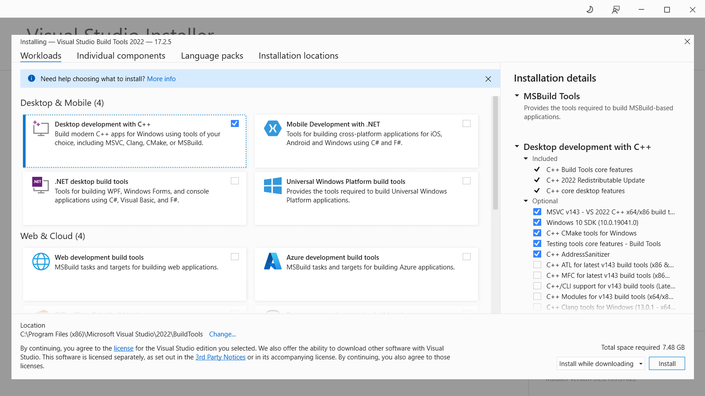
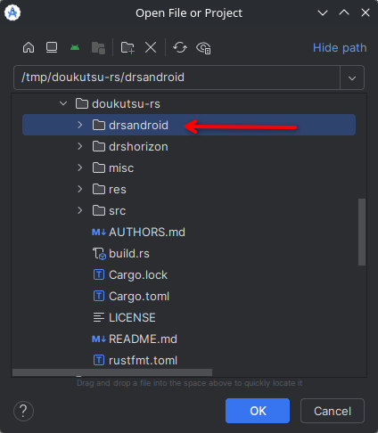
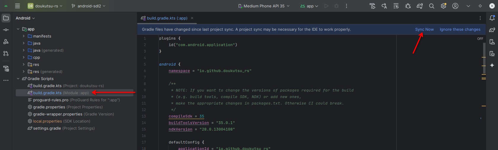

# Building the ports

doukutsu-rs has two official ports: one stable and one experimental.


Although the term "port" is often used in relation to PC builds, doukutsu-rs was originally developed for the PC and only later **ported** to other platforms.


Stable ports:

* Android

Experimental ports:

* Nintendo Switch (also referred as Horizon)

**Stable ports** are part of the upstream codebase, they are actively maintained and have official release builds. They can definitely be compiled and the compilation steps are known and most likely documented.

**Experimental ports**, on the other hand, typically don't have nightly builds, and their build algorithm may be undocumented or even broken. But the main reason for classifying a port as experimental is its instability.

For example, the Horizon port has release builds for several versions and is located in the `master` branch alongside stable ports. However, it causes hbloader to crash on real hardware from time to time, which is reason to consider it unstable. Furthermore, it's not well maintained, so based on all these factors, it has been labeled as experimental.

Please note that this guide provides instructions for building ports on PC only. So first install Rust and clone the doukutsu-rs repository, as described in [the previous section](./#id-2.-install-rust).

## Android


Starting with version 1.0.0, the Android port has been refactored and moved to the SDL2 backend in order to support controllers. That is why the documentation includes instructions for building the new version of the port (1.0.0 and later) and versions that ran with the Glutin backend (0.102.0-beta7 and earlier).



On Windows, the username must contain only ASCII characters; otherwise, the build will fail for versions later than 0.102.0-beta7. This requirement does not apply to version 0.102.0-beta7 and earlier.


### 1. Install Java

The Android port is written in Java, and the build tools require the Java Runtime, so you need to install JDK (Java Development Kit) to build this port. The **minimum** version of Java required to run Android development tools is **Java 17**.



On Windows you can install JDK following [the official installation instructions](https://docs.oracle.com/en/java/javase/21/install/installation-jdk-microsoft-windows-platforms.html#GUID-A7E27B90-A28D-4237-9383-A58B416071CA) provided by Oracle.



On Linux, JDK is usually installing from the repositories of the distribution you are using.

**Arch-based distributions (Arch Linux, Manjaro, EndeavourOS, etc.):**

```
sudo pacman -Sy jdk17-openjdk
```

**Debian-based distributions (Debian, Ubuntu, Linux Mint, Pop!\_OS, etc.):**

```
sudo apt update
sudo apt install openjdk-17-jdk
```



### 2. Install Android Studio

Android Studio is the primary IDE for Android applications development, so in this guide we'll use it.

To install Android Studio, download it from [the Android Developers portal](https://developer.android.com/studio).



The **minimum** version required for building doukutsu-rs is **Meerkat Feature Drop | 2024.3.2**.



The **minimum** version required for building doukutsu-rs is **Flamingo | 2022.2.1**.





Download the installer and just install Android Studio. Then run it via a shortcut in the Start Menu or Desktop.



After downloading the archive, extract it to any location you want (in this example we will extract it into `~/.bin`):

```
tar -xvpzf {DOWNLOADED_ARCHIVE_NAME}.tar.gz -C ~/.bin
```

Then open a console (if you hasn't open it yet), enter into the extracted folder, and run `bin/studio.sh`script (give it execute permission, if it isn't set):

```
cd ~/.bin/android-studio/bin
chmod +x studio.sh
./studio.sh
```



***

If Android Studio is started without any errors, you can move to the next step.

### 3. Install Rust targets

The Android builds of doukutsu-rs supports ARMv7, ARMv8, x86 and x86-64 architectures. To build it you need to install the appropriate Rust targets:

```
rustup target add aarch64-linux-android armv7-linux-androideabi i686-linux-android x86_64-linux-android
```



The build process also requires the `cargo-ndk` utility to be installed:

```
cargo install cargo-ndk
```



### 4. Install Android development kits

Launch Android Studio and on the welcome screen, press `"More actions"` and select `"SDK Manager"` from the drop-down menu. In the window that opens, tick `"Show package details"`.

<figure><figcaption><p><code>"Show Package Details"</code> is checked.</p></figcaption></figure>



To understand what version of the development kits you need to install, look at the `drsandroid/app/build.gradle.kts` file from the doukutsu-rs directory. In this build config `compileSdkVersion` property stores the API level, that you can use to install the required Platform SDK. `buildToolsVersion` and `ndkVersion` store the exact version of build tools and NDK, required for build. Also install **CMake 3.22+** in the SDK Manager.



To understand what version of the development kits you need to install, look at the `app/app/build.gradle` file from the doukutsu-rs directory. In this build config `compileSdkVersion` property stores the API level, that you can use to install the required Platform SDK. `buildToolsVersion` and `ndkVersion` store the exact version of build tools and NDK, required for build. Also install **CMake 3.18+** in the SDK Manager.




Install exactly the development kits version, that are specified in the build config. Otherwise the build may fail.


### 5. Configuring the project



Initialize port-specific build dependencies (run this command from the cloned doukutsu-rs directory):

```
git submodule update --init --recursive drsandroid
```



When all dependencies are installed, we can finally open the project in Android Studio and configure it for building.



Open Android Studio, click `"Open project"` and select the `drsandroid` directory from the cloned doukutsu-rs repository.

<figure><figcaption><p>Open this exact folder, not the cloned repository itself or anything else.</p></figcaption></figure>

When you open the project, in the bottom right corner will appear a notification asking you to install Android Gradle Plugin. Install it. If it will suggest to upgrade it, dismiss this notification.

After that, open `build.gralde.kts` file from the `app` module and sync the project.

<figure><figcaption><p>Open the build config from the <code>app</code> module and sync the project.</p></figcaption></figure>


If after sync or build attempt, you get an error like `"SDK not found"` or `"NDK not found"`, but you are sure that you have installed the correct versions of SDK and NDK, you need to manually specify the paths to them.

Create a `local.properties` file and place the following content in it (replace `{ANDROID SDK installation path}` with the absolute path where you installed the Android SDK and `{NDK version}` with the version of NDK specified in the doukutsu-rs build config):


```properties
sdk.dir={ANDROID SDK installation path}
ndk.dir={ANDROID SDK installation path}/ndk/{NDK version}/
```


For example, if you are working on Windows and have installed SDK in the `C:\Android\Sdk`, this file will look like this:


```properties
sdk.dir=C\:\\Android\\Sdk
ndk.dir=C\:\\Android\\Sdk\\ndk\\25.2.9519653\\
```


Resync the project and try to run the build.




Open Android Studio, click `"Open project"` and select the `app` directory from the cloned doukutsu-rs repository.

<figure><figcaption><p>Open this exact folder, not the cloned repository itself or anything else.</p></figcaption></figure>

When you open the project, in the bottom right corner will appear a notification asking you to install Android Gradle Plugin. Install it. If it will suggest to upgrade it, dismiss this notification.

After that, open `build.gralde` file from the `app` module and sync the project.

<figure><figcaption><p>Open the build config from the <code>app</code> module and sync the project.</p></figcaption></figure>


If after sync or build attempt, you get an error like `"SDK not found"` or `"NDK not found"`, but you are sure that you have installed the correct versions of SDK and NDK, you need to manually specify the paths to them.

Create a `local.properties` file and place the following content in it (replace `{ANDROID SDK installation path}` with the absolute path where you installed the Android SDK and `{NDK version}` with the version of NDK specified in the doukutsu-rs build config):


```properties
sdk.dir={ANDROID SDK installation path}
ndk.dir={ANDROID SDK installation path}/ndk/{NDK version}/
```


For example, if you are working on Windows and have installed SDK in the `C:\Android\Sdk`, this file will look like this:


```properties
sdk.dir=C\:\\Android\\Sdk
ndk.dir=C\:\\Android\\Sdk\\ndk\\25.2.9519653\\
```


Resync the project and try to run the build.




### 6. Build

If you lucky enough to not encounter errors or troubles in the previous steps, you can click a hammer on the top panel or press `Ctrl+F9` to build the project.



The output APK will be in the `drsandroid/app/build/outputs/apk/debug` folder.

By default the debug builds that support only ARMv8 (`arm64-v8a`) and x86-64 architecture will be generated. If you want to make a debug build for another architecture, you need to change the architectures list in the `android.buildTypes.debug.ndk` section.



The output APK will be in the `app/app/build/outputs/apk/debug` folder.

By default the debug builds that support only ARMv8 (`arm64`) architecture will be generated. If you want to make a debug build for another architecture, you need to change the targets field in the `cargoNdk.buildTypes.debug` section (it is located at the end of build config).



### 7. (Optional) Signing the build

All builds **require** signing, unsigned builds cannot be installed (you will get an error, if you try to install an unsigned build). Debug builds are automatically signed by Android Studio's built-in keystore, but release builds requires manual configuration. To generate a signed release build, click **"Build"** -> **"Generate Signed Bundle / APK"**. Choose **"APK"** and the keystore for signing, if it exists, or create one if it doesn't.


If you create a keystore in the Android Studio, only the password and the issuer's "First and Last Name" fields are mandatory. All other fields can be left blank.


When you complete, Android Studio will automatically run the build with specified signing keystore.



The generated build will be placed in `drsandroid/app/build/outputs/apk/release`.



The generated build will be placed in `app/app/build/outputs/apk/release`.



## Nintendo Switch (Horizon)




Although the Horizon port can _**probably**_ be compiled on 64-bit Windows using MSYS2, the build process has only been tested on x86-64 (AMD64) Linux system, so compilation on other platforms and architectures is not guaranteed, and isn't covered in this guide.


### 1. Install dependencies

Build process of the Horizon port depends primarily on the Switch homebrew toolchain provided by devkitPro. It uses the `uam` utility to compile shaders, `deko3d` as a graphics API, and many other tools to compile and package doukutsu-rs in the format that can be run on Switch.

devkitPro toolchains can be installed with the Arch Linux package manager `pacman`, also provided by devkitPro for macOS and other common Linux distros. On Widows they can be installed with a graphical installer. Setup instructions can be found on [the devkitPro Wiki](https://devkitpro.org/wiki/Getting_Started#Setup).

After installing `pacman` (or `dkp-pacman`), install the Switch development kit:

```
sudo pacman -Sy switch-dev
```

Don't forget to set environment variables containing the path to the development kit installation folder:

```
export DEVKITPRO=/opt/devkitpro
export DEVKITARM=/opt/devkitpro/devkitARM
```

You also need the same development dependencies, as for the building the Linux port on a Linux system ([#id-1.-install-the-development-dependencies](./#id-1.-install-the-development-dependencies "mention")), along with a few additional dependencies:

#### Arch-based distributions (Arch Linux, Manjaro, EndeavourOS, etc.)

```
sudo pacman -Sy python python-distutils-extra ninja
```

#### Debian-based distributions (Debian, Ubuntu, Linux Mint, Pop!\_OS, etc.)

```
sudo apt install python3 python3-distutils-extra ninja-build
```

#### Red Hat-based distributions (CentOS, Fedora, etc.)

```
sudo dnf install python python-distutils-extra ninja-build
```

### 2. Install Rust toolchain

We use a patched Rust toolchain to enable the `std` lib support for the Nintendo Switch target.

You can either **(A)** install it from the precompiled archive, or **(B)** compile the toolchain from source.

#### A. Installing a precompiled toolchain

Download the latest version of the toolchain from [its repository](https://github.com/doukutsu-rs/rust-hos/releases) and extract the archive to `$HOME/.rustup/toolchains` on Linux.

Enter the `drshorizon` directory in the cloned doukutsu-rs repository and and set a toolchain to be used for building (replace `TOOLCHAIN` with the name of the folder you extracted from the downloaded toolchain archive, i.e. `1.92.0-switch`):

```
rustup override set TOOLCHAIN
```

#### B. Building from source


Building the toolchain will produce ≈20 GiB of build artifacts, which will require a total of ≈30 GiB of free disk space to build the port.


Clone this toolchain (if you need to access the commit history, remove the `--depth 1` flag):

```
git clone --depth 1 https://github.com/doukutsu-rs/rust-hos.git
```

The target definition files aren't included in the toolchain, so copy them from the `drshorizon` folder of the cloned doukutsu-rs repository:

```
cp drshorizon/aarch64* rust-hos/
cd rust-hos
```

The build config is also not included in the toolchain, so copy the following contents into the `bootstrap.toml` file:

```toml
# Replace "x86_64-unknown-linux-gnu" with the target of your host platform
# (e.g. "x86_64-pc-windows-gnu" if you building on Windows using MSYS).
build.target = ["x86_64-unknown-linux-gnu", "aarch64-nintendo-switch.json"]

build.docs = false
build.extended = true
build.tools = ["src"]

# Incremental build may be useful when you rebuilds the toolchain often,
# but usually you need to build it only once.
rust.incremental = true

# LTO increases build time significantly and gives not so big perfomance benefits,
# so we disable it
rust.lto = "off"

# Since Rust CI builds are deleted over time, we'll build Rust and LLVM from sources
rust.download-rustc = false

[llvm]
download-ci-llvm = false
targets = "AArch64;ARM;X86"
experimental-targets = ""
polly = true
```

Now you can build the toolchain:

```
./x build --stage 1
```

If the build completed successfully, install the compiled toolchain as `rust-switch`:

```
rustup toolchain link rust-switch build/host/stage1
```

Do not remove or move the toolchain folder or `build` folder, because “installing” the custom toolchain in this case literally means creating a symlink to the toolchain folder under some toolchain name. Therefore, if you delete or move this folder, you will no longer be able to use this toolchain to compile the Horizon port.


If you don't plan to recompile the toolchain later, you can delete all folders in the `build/host` directory except for `stage1` and `stage1-std` folders. It's better to do this after you ensure that the port compiles without errors.


Enter the `drshorizon` directory in the cloned doukutsu-rs repository and and set a toolchain to be used for building:

```
rustup override set rust-switch
```

### 3. Build doukutsu-rs

Enter the `drshorizon` directory in the cloned doukutsu-rs repository and run the build script:

```
./build_debug.sh
```

Output file `drshorizon.nro` will be placed in the `target/aarch64-nintendo-switch/debug` folder.

If you want to compile a release (optimized) build, run the `build_release.sh` script. The output file will be located in the `target/aarch64-nintendo-switch/release` folder.

## Port feature completeness

Table legend:

* ✓ - implemented
* \* - partially implemented
* ❌ - unimplemented

|          Feature         | Android |    Horizon    |
| :----------------------: | :-----: | :-----------: |
| Open user/data directory |    ✓    | ❌<sup>1</sup> |
|  Portable user directory |    ❌    | ❌<sup>1</sup> |

1. Horizon doesn't have a builtin file manager, and there are no sense to implement a portable user directory for this platform.
